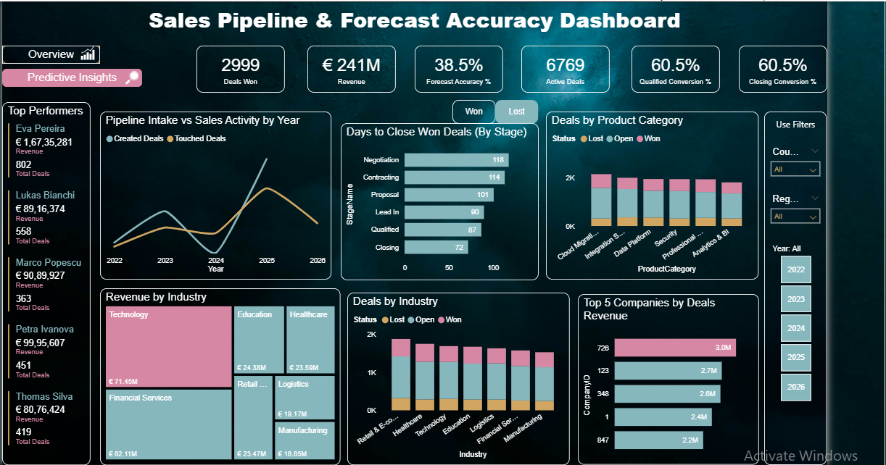
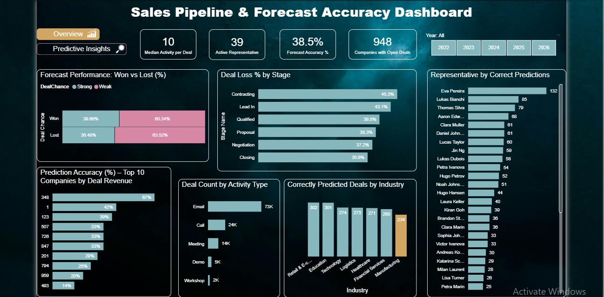

# Sales Pipeline and Forecast Accuracy Analysis (Power BI)

## Project Overview
This project analyzes a B2B Sales Pipeline to evaluate deal performance, forecast accuracy, and revenue trends from 2022 onwards.

The objective is to enable data-driven decision making by improving deal predictability, conversion efficiency, and overall sales performance.

---

## Problem Statement
The business requires:
- An overview of deal performance since 2022
- Forecast accuracy measurement
- Conversion rate analysis
- Industry-level revenue breakdown
- Identification of bottlenecks in deal stages

---

## Tools Used
- Power BI  
- Power Query  
- DAX (Data Analysis Expressions)

---

## Dashboard Preview

### Overview Dashboard

### Predictive Insights Dashboard

---

## Key KPIs
- Forecast Accuracy Percentage
- Deals Won
- Revenue
- Active Deals
- Qualified Conversion Percentage
- Closing Conversion Percentage
- Deal Loss Percentage by Stage
- Days to Close by Stage
- Deal Count by Activity Type
- Revenue by Industry
- Representative Performance

---

## Key Insights
- Forecast accuracy is 38 percent, indicating weak predictability.
- Only 30 out of 100 won deals were correctly predicted.
- 60 percent of qualified deals convert to closed deals.
- Average 114 days required to close deals from Contracting stage.
- Manufacturing industry generates the lowest revenue at 16 million EUR.
- Predictability is weakest in Manufacturing.
- Approximately 10 activities are performed per deal.
- Predictability is below 50 percent even for top revenue companies.

---

## Recommendations
- Improve forecast modeling for better deal predictability.
- Reduce time taken in Contracting stage.
- Increase focus on Calls and Meetings instead of Email-heavy activity.
- Improve daily deal engagement for open deals.
- Reduce performance gap between top and average representatives.
- Improve strategy for Manufacturing industry deals.

---

## Author

Pratyush Pradeep  
HR Analyst | Data Analytics Enthusiast | Power BI Developer
